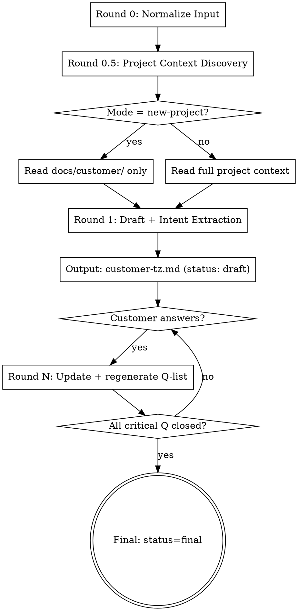

# /customer-tz — Customer-Friendly TZ Builder

## Назначение

Скил превращает сырой мультимодальный ввод заказчика (текст, переписка, voice, картинки, схемы) в **один Markdown-файл на русском** — френдли ТЗ, которое разработчик обсуждает с заказчиком ДО старта `feature-workflow` Discovery.

**Core principle:** этот документ — *инструмент разговора*, не финальная спека. На языке заказчика, без техжаргона, с устранёнными разночтениями терминов, с явными открытыми вопросами и стабильной нумерацией для ссылок.

## Когда использовать

**Use when:**
- Заказчик прислал переписку / док / голосовое / картинки / схемы про идею
- Идея — новый проект или новая фича существующего проекта
- Нужен артефакт для обсуждения С заказчиком, не ДЛЯ разработчика
- Проект — dev (есть `project_type: dev` в CLAUDE.md или признаки кода)

**Do NOT use when:**
- Life-проект (Health, Family, Budget, Hobby) — блок на старте
- Заказчик уже дал готовое формальное ТЗ — переходи сразу в `feature-workflow` Discovery
- Нужна спека для разработчика — используй `feature-workflow` шаг 2 (Discovery) напрямую
- Внутренний рефакторинг / багфикс без участия заказчика

## Жизненный цикл



## Запуск

```
/customer-tz                        # Auto-detect mode + читает текущую папку
/customer-tz --mode=new-project     # Принудительно режим нового проекта
/customer-tz --mode=new-feature     # Принудительно режим новой фичи
/customer-tz --round=N --answers=path/to/answers.md   # Продолжение раунда
```

Если аргумент не передан и есть ввод в сообщении пользователя — берём его. Если нет ввода — спрашиваем: *«Дай ввод заказчика (текст, ссылки на файлы, описание картинок) или путь к файлу с ответами на прошлый раунд.»*

---

## Round 0: Normalize Input

Цель — превратить любой ввод в единый текстовый корпус с сохранением источников.

**Текст / переписка:** берём как есть, сохраняем абзацы и подписи участников.

**Voice / аудио:** транскрипция через `faster-whisper` (или другой STT, доступный в проекте). Метаданные: длительность, дата. Текст сохраняется отдельным абзацем с пометкой `[voice: filename, HH:MM]`.

**Картинки / скриншоты / схемы:** описание через vision-возможности модели — что изображено, какие элементы, текстовое содержимое (OCR). Описание помечается `[image: filename]`.

**Документы (PDF, DOCX):** извлечение текста. Сохраняем структуру (заголовки), убираем декоративные элементы.

**Метаданные источников** записываются во frontmatter будущего файла в поле `sources:`.

**Anti-rule:** не интерпретируем картинки на этом шаге — только описываем содержимое. Интерпретация — Round 1.

---

## Round 0.5: Project Context Discovery

Цель — собрать **внутренний context-packet** о состоянии проекта. Этот packet НЕ публикуется в TZ, но питает Round 1.

### Сначала — детекция режима

```
new-project mode    if:  нет pyproject.toml AND нет src/ AND нет .git с историей
                         OR пользователь явно передал --mode=new-project
new-feature mode    otherwise
```

В режиме `new-project` читаем только пункт 0 (если папка существует) — остальные источники отсутствуют.

В режиме `new-feature` читаем все источники ниже по приоритету.

### Источники (по приоритету)

0. **`docs/customer/*.md` — ВСЕ прошлые customer-tz** (если папка существует). Парсим frontmatter каждого:
   - `same customer + status: final` → **HIGH** (берём целиком: глоссарий, out-of-scope, closed questions)
   - `same customer + status: round-N|draft` → **MEDIUM** (помечаем как «незакрытое»)
   - `different customer + status: final` → **LOW** (только стилистика + общепроектные термины)
   - `different customer + draft` → **SKIP**
1. **Проектный `CLAUDE.md`** — стек, архитектура, правила, `project_type`
2. **`docs/knowledge-graph.xml`** — карта модулей, контракты, зависимости
3. **`docs/development-plan.xml`** + **`docs/verification-plan.xml`** — что в работе, что покрыто
4. **`docs/superpowers/specs/*-discovery.md`** — существующие фичи (FR/NFR + статусы)
5. **`docs/superpowers/specs/*-design.md`** — принятые технологические решения
6. **`docs/adr/*.md`** — архитектурные решения (часто содержат «НЕ делаем X»)
7. **`docs/reports/*-report.md`** — закрытые работы, lessons learned
8. **`MODULE_CONTRACT` в исходниках** — публичные контракты
9. **`Makefile` / `pyproject.toml`** — команды, версии зависимостей
10. **Beads** — `bd list --status=open` + `bd list --status=in_progress` (если `.beads/` есть)

### Что собираем во внутренний context-packet

```
- existing_features:           [список с краткой аннотацией]
- in_flight_features:          [open/in_progress beads issues]
- architectural_constraints:   [из ADR + technology.xml]
- canonical_glossary:          [из Term Aggregation]
- overlaps_with_request:       [где запрос пересекается с существующим]
- conflicts_with_request:      [где запрос противоречит]
- gaps_in_request:             [что критично, но не упомянуто]
- past_tz_same_customer:       [HIGH priority TZ]
- past_tz_other_customers:     [LOW priority TZ]
- previously_closed_questions: [не переспрашиваем]
- previously_agreed_oos:       [наследуется]
- customer_vocabulary_history: [синонимы этого заказчика ранее]
- cross_feature_links:         [ссылки на прошлые TZ]
- blind_spot_findings:         [результат прохода по Blind Spot Taxonomy]
```

### Blind Spot Taxonomy (обязательный чек-лист)

Round 0.5 **проактивно** проходит по 10 категориям и фиксирует, что заказчик НЕ упомянул. По каждой неупомянутой категории → автоматически Q-вопрос в раздел 13 с приоритетом 🟡 important.

1. **Авторизация** — кто видит, кто не видит, регистрация нужна?
2. **Edge cases / ошибки** — нет интернета, упало приложение, неверный ввод
3. **Пустые состояния** — что показать, когда данных ещё нет
4. **Лимиты / ограничения** — сколько чего можно/нельзя в день/месяц/всего
5. **Платность / монетизация** — бесплатно? тарифы? пробный период?
6. **Уведомления** — push, email, SMS — когда и кому
7. **Приватность / данные** — что собираем, кому показываем, удаляем по запросу?
8. **Языки / локализация** — один язык или несколько
9. **Платформы** — web / iOS / Android / Telegram — где работает
10. **Интеграции** — внешние сервисы (платёжка, аналитика, CRM)

---

## Round 1: Draft

### Intent Extraction (внутренний шаг перед записью в файл)

Сформулировать явно 4 уровня:

1. **Stated goal** — что заказчик буквально просит
2. **Underlying job** — какую проблему он решает (job-to-be-done)
3. **Success picture** — как выглядит «всё получилось» в его представлении
4. **Hidden constraints** — что не сказал, но что точно влияет (бюджет, политика, время, конкуренты)

Stated goal попадает в раздел 1 output-файла первым абзацем. Underlying job — вторым абзацем, явно сформулированное, с пометкой *«нужно подтверждение заказчика»* и автоматическим Q-вопросом 🔴 critical.

### Customer Persona Detection

По лексике и упоминаемым KPI определяем `customer_persona`:

```
marketer       — оперирует: конверсии, аудитория, каналы, воронка, CAC, LTV, креативы
business-owner — оперирует: прибыль, выручка, скорость вывода, доля рынка
finance        — оперирует: ROI, costs, рентабельность, риски, отчётность
analyst        — оперирует: метрики, дашборды, сегменты, данные, A/B-тесты
mixed          — несколько ролей одновременно
unknown        — не удалось определить
```

Записывается во frontmatter. Разделы 7 (Качественные требования) и 9 (Метрики успеха) подстраивают акценты под персону:
- marketer → акцент на скорость загрузки, удобство мобильного UX, понятные CTA
- finance → акцент на стоимость владения, риски, отчётность
- analyst → акцент на собираемые данные, экспорты, фильтры
- business-owner → акцент на time-to-market, простота поддержки

### Генерация черновика

Скил создаёт файл `docs/customer/YYYYMMDD-{feature-slug}-tz.md` со `status: draft`, заполняя все 13 разделов на основе ввода + context-packet. Незаполнимые места помечаются `_[TBD — см. вопрос Q-NN]_` с генерацией соответствующего открытого вопроса.

---

## Term Aggregation Algorithm

Цель — собрать **канонический глоссарий** и устранить разночтения.

### Шаг 1. Сбор сырых терминов из ввода заказчика

Извлекаем все существительные / именованные сущности, упомянутые в Round 0 нормализованном корпусе. Группируем по контексту (соседним n-граммам).

### Шаг 2. Сбор канонических терминов из проекта

Из источников Round 0.5 (knowledge-graph.xml, MODULE_MAP, past discovery.md, past customer-tz.md):
- модули
- сущности БД
- экраны / разделы UI
- роли пользователей
- ключевые операции

### Шаг 3. Маппинг — синонимы

Для каждого термина заказчика ищем совпадение с каноническим (через лексическое сходство, контекст, синонимические ряды). Группируем:

```
G-01 кнопка (button)
   синонимы заказчика: нажималка, баттон, давилка, кликалка
   определение: элемент интерфейса для запуска действия
```

### Шаг 4. Маппинг — омонимы (КРИТИЧНО)

Если один и тот же термин заказчика встречается в **разных контекстах** или **разных семантических полях** — разносим как разные термины:

```
G-02 карта (Таро) — игровая карта в раскладе
G-03 карта (платёжная) — банковская карта для оплаты подписки
```

И автоматически создаём Q-вопрос 🔴 critical: «В пункте X имеется в виду G-02 или G-03?»

### Шаг 5. Маппинг — аналогии и образы

Заказчик использует сравнения («как Airbnb», «уютный дом», «типа Uber»). Они идут в подсекцию глоссария «Аналогии и образы»:

```
Что сказал заказчик     | Что значит технически                | Где используется
«как Airbnb для X»      | marketplace + ratings + chat         | разделы 5, 6
«тёплый дом»            | дружелюбный UX-тон, не корпоративный | раздел 7 (NFR: UX-тон)
```

Для каждой аналогии — автогенерация уточняющего вопроса: «Что именно из *{аналог}* важно — A, B или C?» с приоритетом 🟡 important.

### Шаг 6. Cross-customer glossary diff (только в new-feature mode)

Если у разных past-заказчиков были разные слова про одно и то же → флаг для текущего раунда: «выбрать каноническое для проекта».

---

## Rounds 2..N: Q&A Iteration

Цель — обновить файл после ответов заказчика и сгенерировать новый список открытых вопросов.

### Вход раунда

- Текущий `docs/customer/YYYYMMDD-{feature-slug}-tz.md` (последняя версия)
- Ответы заказчика — текст / voice / картинки в любом формате

### Алгоритм раунда

1. **Match answers to Q-IDs.** Каждый ответ привязывается к открытому вопросу по ID (Q-01, Q-02 …). Если ID не указан — пробуем по семантическому сходству. Неоднозначные привязки → внутренний log, не пишем в файл.

2. **Update affected sections.** Для каждого закрытого вопроса:
   - В разделе 13: статус 🟡 open → 🟢 answered, поле «Ответ заказчика» заполняется
   - В соответствующем тематическом разделе (FR/NFR/OOS/AC) — встраиваем ответ как уточнение

3. **Re-run Term Aggregation.** Ответы могут принести новые термины — добавляем в глоссарий, при необходимости генерируем новые Q-вопросы.

4. **Re-run Blind Spot pass** — некоторые слепые зоны могли открыться благодаря ответам, другие — закрыться.

5. **Regenerate Open Questions list.** Закрытые вопросы остаются с теми же ID (стабильные ID — закон). Новые вопросы получают следующие свободные номера.

6. **Bump `round:` field in frontmatter.**

### Anti-rule

ID **никогда** не переиспользуются. Если Q-03 закрыт, новый вопрос получит Q-NN, где NN = max существующих + 1.

---

## Final Round

Переключаем `status: final` когда:
- Все вопросы с приоритетом 🔴 critical имеют статус 🟢 answered (или явно ⚪ deferred с пояснением)
- Заказчик подтвердил, что готов передать TZ разработчику

После Final скил **не вызывается повторно для этого файла**. Изменения после Final — через `feature-workflow` Discovery, который читает финальный TZ как вход.

---

## Output File Spec

### Путь

```
docs/customer/YYYYMMDD-{feature-slug}-tz.md
```

`YYYYMMDD` — дата создания (не последнего обновления). `{feature-slug}` — короткое kebab-case-имя фичи на английском (для consistency с именованием в проекте).

### Frontmatter

```yaml
---
feature: feature-slug
customer: "Имя Фамилия или название компании"
customer_persona: marketer | business-owner | finance | analyst | mixed | unknown
mode: new-project | new-feature
status: draft | round-2 | round-3 | ... | final
round: N
date: YYYY-MM-DD
sources:
  - "переписка из Telegram, 2026-05-20"
  - "voice: customer_brief.ogg, 03:42"
  - "image: sketch.png"
related_tz:
  - docs/customer/20260301-loyalty-program-tz.md
---
```

### Convention стабильных ID

Все элементы во ВСЕХ разделах получают устойчивые ID. ID не переиспользуются между раундами.

```
G-NN     термин в глоссарии              (раздел 2)
ST-NN    stakeholder / роль              (раздел 3)
TH-NN    тема (с под-уровнем TH-NN.M)    (раздел 4)
US-NN    user scenario                   (раздел 5)
FR-NN    функциональное требование       (раздел 6)
NFR-NN   качественное требование         (раздел 7)
A-NN     предположение / ограничение     (раздел 8)
KPI-NN   метрика успеха                  (раздел 9)
R-NN     референс / похожий продукт      (раздел 10)
OOS-NN   out-of-scope item               (раздел 11)
AC-NN    acceptance criterion            (раздел 12)
Q-NN     открытый вопрос                 (раздел 13)
```

### 13 разделов

См. `template.md` — там готовый шаблон с placeholder-ами всех разделов на русском.

Краткий состав:
1. **Краткое описание** — что просим сделать + зачем (underlying job)
2. **Глоссарий** — таблица термин/синонимы/определение + подсекция «Аналогии и образы»
3. **Заинтересованные лица и роли** — кто решает, согласует, пользуется
4. **Структура по темам** — 2-уровневая нумерация (TH-NN, TH-NN.M)
5. **Сценарии использования** — путь пользователя в прозе
6. **Функциональные требования** — нумерованный список FR-NN
7. **Качественные требования** — таблица «свойство → как поймём»
8. **Предположения и ограничения** — нумерованный A-NN
9. **Метрики успеха** — KPI заказчика
10. **Похожие продукты / референсы** — R-NN
11. **Что НЕ войдёт** — OOS-NN с источником («согласовано в past-tz / новое»)
12. **Критерии готовности** — чек-лист AC-NN
13. **Открытые вопросы** — реестр Q-NN с полями: вопрос / приоритет / статус / ответ заказчика

### Маркер обсуждения

В любом разделе можно вставить inline:

```
> 💬 Обсудить: что именно входит в «уютный тон» — формальные «вы» или дружеское «ты»?
```

Это подсказки заказчику, куда смотреть внимательно. Не путать с Open Questions — маркеры обсуждения не имеют ID и не блокируют переход в Final.

---

## Customer-Friendly Language Rules

### Что писать

- Глаголы действия: «пользователь видит», «бот спрашивает», «система присылает»
- Бизнес-сущности: «карта», «расклад», «подписка», «вопрос»
- Количественные ограничения в человеческих единицах: «не дольше 3 секунд», «до 5 раз в день»

### Что НЕ писать

❌ API, endpoint, route, webhook
❌ database, table, column, migration, schema
❌ class, method, ORM, model, instance
❌ async, queue, worker, scheduler
❌ Docker, container, deployment, CI/CD
❌ middleware, dependency injection, factory
❌ HTTP-коды, JSON, REST, GraphQL

### Если без техтермина никак

Дать определение в Глоссарии в человеческих словах, рядом — каноническое английское имя в скобках. Использовать русское везде в основном тексте, английское — только в скобках при первом упоминании.

Пример:
> *«После выбора подписки (subscription) пользователь получает доступ к расширенным функциям…»*

---

## Quick Reference

| Действие | Команда / выход |
|----------|-----------------|
| Первый запуск с вводом | `/customer-tz` + ввод → файл со `status: draft` |
| Принудительно новый проект | `/customer-tz --mode=new-project` |
| Принудительно новая фича | `/customer-tz --mode=new-feature` |
| Раунд после ответов | `/customer-tz --round=2 --answers=answers.md` |
| Закрытие | автоматически при `status: final` |

### Что меняется между раундами

| Поле | Round 1 | Round N | Final |
|------|---------|---------|-------|
| `status` | `draft` | `round-N` | `final` |
| `round` | 1 | N | N |
| Закрытые Q-NN | — | 🟢 answered | все 🔴 закрыты |
| Новые Q-NN | — | возможны | нет |
| Глоссарий | первичный | обогащённый | заморожен |

---

## Common Mistakes

| Ошибка | Как исправить |
|--------|---------------|
| Техжаргон попал в текст | Run Red Flags check (см. ниже), переписать с глоссарием |
| Q-IDs переиспользованы между раундами | Никогда. Новый вопрос = следующий свободный номер |
| Глоссарий разный в разных разделах | Один canonical term — везде одинаково. Term Aggregation запускается на каждом раунде |
| Open Questions потеряны между раундами | Все Q-NN остаются в реестре навсегда. Меняется только статус |
| Аналогии заказчика выброшены | Все аналогии сохраняются в подсекции «Аналогии и образы» + автоматический Q-вопрос на уточнение |
| Омонимы слиты в один термин | Term Aggregation шаг 4: разные контексты → разные G-NN + 🔴 Q-вопрос |
| Frontmatter `customer:` пустой | Спросить пользователя перед сохранением |
| Файл сохранён вне `docs/customer/` | Hard rule: путь фиксирован |
| Final без закрытия 🔴 critical вопросов | Final блокируется, пока хоть один 🔴 имеет статус 🟡 open |

---

## Red Flags — STOP and Revise

Если в готовом TZ встречается любое из этого — **переписать раздел**:

- Слова: `API`, `endpoint`, `route`, `webhook`, `database`, `table`, `migration`, `class`, `method`, `ORM`, `model`, `async`, `queue`, `worker`, `Docker`, `container`, `middleware`, `JSON`, `REST`, `GraphQL`, `HTTP`
- Английские слова в основном тексте (вне глоссария / скобок при первом упоминании)
- HTTP-коды (404, 500)
- Имена файлов / путей / расширений
- Имена библиотек / фреймворков
- Регулярные выражения / куски кода
- Markdown-таблицы с типами данных (`string`, `int`, `boolean`)

Все эти признаки = TZ написана для разработчика, не для заказчика. Переписать.

---

## Anti-rationalization Table

| Rationalization | Reality |
|-----------------|---------|
| «Заказчик технически грамотный, можно оставить API» | Нет. Цель — общий язык. Если он спросит про API — добавишь в глоссарий, но текст остаётся бизнес-языком |
| «Один документ слишком большой, разобью на 2-3» | Нет. Один файл — locked decision. Длинно — значит, фича большая, дроби фичу, не документ |
| «Все вопросы важные, сделаю всё 🔴 critical» | Нет. Приоритеты теряют смысл без дискриминации. 🔴 = «без ответа Discovery не стартует» |
| «Заказчик не ответит на 20 вопросов, спрошу 3-5» | Нет. Все слепые зоны — в реестре. Приоритеты помогают заказчику начать с критичных. Остальные ждут |
| «Аналогии — это вода, выброшу» | Нет. Аналогии — носитель смысла. Сохраняем + уточняем |
| «Past TZ устарел, проигнорирую» | Нет. Сравниваем с кодом. Если устарел — помечаем «исторический контекст», но используем для словаря |
| «Sign-off-блок добавлю на всякий случай» | Нет. Locked decision: sign-off НЕ добавляется. git-history достаточно |
| «Round 0.5 займёт много времени, пропущу для простой фичи» | Нет. Простая фича всё равно требует глоссария → требует Round 0.5 |

---

## После создания / обновления файла

1. Показать пользователю краткое резюме: путь к файлу, количество разделов с заполнением, количество открытых Q-NN по приоритетам (🔴 N / 🟡 M / 🟢 K)
2. Подсказать следующий шаг:
   - Если `status: draft` или `round-N` — *«Отправь файл заказчику. Когда придут ответы, запусти `/customer-tz --round={N+1} --answers=…`»*
   - Если `status: final` — *«Готово к Discovery. Запусти `feature-workflow` — он подхватит этот TZ как вход.»*
3. НЕ вызывать автоматически другие скилы. `customer-tz` — worker, не orchestrator.

## Anti-orchestration

Скил не вызывает `feature-workflow`, не вызывает `brainstorming`, не вызывает `grace-*`. Переходы делает пользователь или внешний orchestrator.
